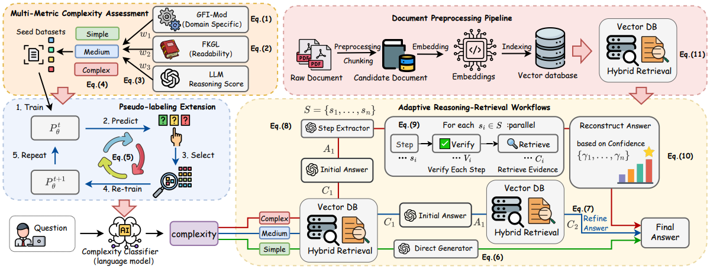

# ALEX: Adaptive Legal Explanation System

Existing legal Retrieval-Augmented Generation (RAG) systems rely on static workflows, resulting in resource misallocation for queries of varying complexity. To address this, we introduce **ALEX**, an adaptive retrieval architecture that dynamically matches reasoning depth to question complexity.

## 📔 Overview & Contributions

<p align="center">
  <br>
  <strong>Figure 1:</strong> Overview of the ALEX.
</p>


The central innovation of ALEX lies in a two-stage process that first assesses the inherent complexity of a legal question and then routes it to a workflow specifically tailored to that level. By dynamically tailoring the reasoning process, ALEX not only improves accuracy on challenging legal benchmarks but also establishes an optimal balance between analytical depth and computational efficiency.

This paper makes the following contributions:

* A complexity-aware classification framework that automatically categorizes legal questions into three reasoning levels through dual-model validation and pseudo-labeling.  
* An adaptive reasoning architecture featuring three specialized processing workflows that dynamically allocate computational resources based on question complexity.  
* A confidence-driven pseudo-labeling algorithm tailored for legal domain data scarcity, effectively bootstrapping robust classifiers from minimal labeled data.  
* Comprehensive experiments demonstrating substantial improvements over strong baselines while maintaining computational efficiency.  

# 📦 Installation

Follow the steps below to download datasets, preprocess data, train models, and run inference.

##  Download Datasets
We use the following datasets. Please download them from Hugging Face:

- [barexam_qa](https://huggingface.co/datasets/reglab/barexam_qa)  
- [housing_qa](https://huggingface.co/datasets/reglab/housing_qa)  

##  Download Classification Model
We use **flan-t5-large** as the classification model. Please download it from Hugging Face:

- [flan-t5-large](https://huggingface.co/google/flan-t5-large)  

#  Usage
##  Data Processing
Run the following preprocessing scripts to prepare the datasets for training and inference:

```bash
cd processed_data
python split.py
cd processed_data/classify
python lable.py
```
##  Train Classification Model
Train the complexity classifier using the prepared labeled data:

```bash
cd processed_data/classify
python train.py
```
##  Extract PDF Text
Extract text content from the source PDF documents:

```bash
cd processed_data/passage
python processed_data/passage/pdf.py
```

## Build Index
Extract text from source documents and build the vector database for retrieval:

```bash
cd processed_data/passage
python passage.py
python embedding2.py
```

## Run Inference
Execute the main question-answering pipeline:

```bash
cd infer
python create_data.py
python deepseek_infer.py

```